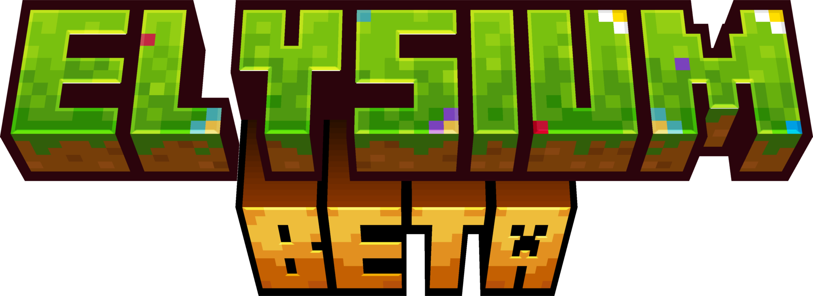

# Elysium



### _An opinionated Vanilla+ Minecraft modpack, with the goal of making survival feel like a real adventure_

## Features

- Extends the base game with new biomes and structures while not adding any new items or blocks, enabling the modpack to
  be used on a modded server while allowing vanilla clients to join
- Preinstalled resource packs that enhance the visual aesthetics of the game
- Preinstalled shader packs with Distant Horizons compatibility that fit the vanilla theme of the modpack
- Tweaked structure generation to avoid the dreaded "overpopulation" of structures from using many mods at once

## Installation

The modpack supports both client and server installation by making use of
the [packwiz](https://github.com/packwiz/packwiz) modpack manager.

> [!TIP]
> It is HIGHLY recommended to use [GraalVM](https://www.graalvm.org/) instead of the regular Oracle JRE or OpenJDK. It
> provides MUCH better performance and should be used with the following arguments:
> <details>
>   <summary>JVM Args</summary>
>   -XX:+UnlockExperimentalVMOptions -XX:+UnlockDiagnosticVMOptions -XX:+AlwaysActAsServerClassMachine
>   -XX:+AlwaysPreTouch -XX:+DisableExplicitGC -XX:+UseNUMA -XX:NmethodSweepActivity=1 -XX:ReservedCodeCacheSize=400M
>   -XX:NonNMethodCodeHeapSize=12M -XX:ProfiledCodeHeapSize=194M -XX:NonProfiledCodeHeapSize=194M
>   -XX:-DontCompileHugeMethods -XX:MaxNodeLimit=240000 -XX:NodeLimitFudgeFactor=8000 -XX:+UseVectorCmov
>   -XX:+PerfDisableSharedMem -XX:+UseFastUnorderedTimeStamps -XX:+UseCriticalJavaThreadPriority
>   -XX:ThreadPriorityPolicy=1 -XX:AllocatePrefetchStyle=3 -XX:+UseZGC -XX:AllocatePrefetchStyle=1 -XX:-ZProactive
>   -XX:+UseZGC -XX:AllocatePrefetchStyle=1 -XX:-ZUncommit -XX:+ZGenerational
> </details>

> [!TIP]
> It is HIGHLY recommended to use 6GB of memory or more when using Distant Horizons to minimize lag, as it causes
> extremely high memory usage in more aggressive settings. If this is impossible or a lower memory footprint is desired,
> it is recommended to install a chunk pre-generator like [Chunky](https://modrinth.com/plugin/chunky) to pre-generate
> all
> chunks and LODs around spawn with more aggressive settings. After that, more lightweight settings can be used.

> [!WARNING]
> Currently Java 23 is incompatible with this modpack

### Client

The preferred way to install Elysium is through the official [Modrinth page](https://modrinth.com/modpack/elysium-modpack) by using a supported launcher such as
the [Modrinth App](https://modrinth.com/app) or [Prism Launcher](https://prismlauncher.org/).
Alternatively, to an `mrpack` file can be created using the following command in the project directory:

```shell
cd src
packwiz modrinth export -o ../Elysium.mrpack
```

A file named `Elysium.mrpack` should be created inside the project directory.

### Server

You will need to have [packwiz-installer](https://packwiz.infra.link/tutorials/installing/packwiz-installer/) and Java
downloaded and installed.

To download the needed server files, execute the below command inside the server instance's
directory, replacing `<DIR>` with the project's directory:

```shell
java -jar packwiz-installer-bootstrap.jar -g -s server "<DIR>/src/pack.toml"
```

> [!IMPORTANT]
> You will need to make sure the port used by Simple Voice Chat is open and reachable by other players.

## License

Elysium is licensed under the [AGPL](LICENSE) license
